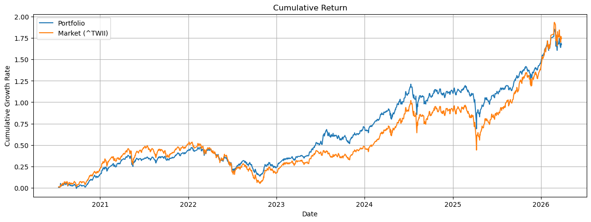
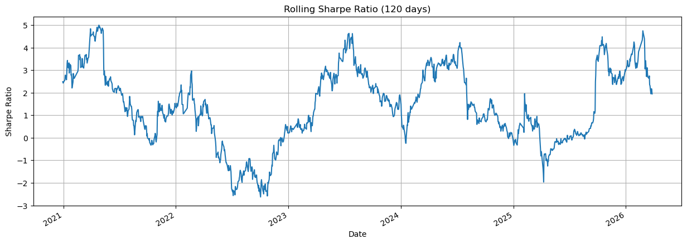
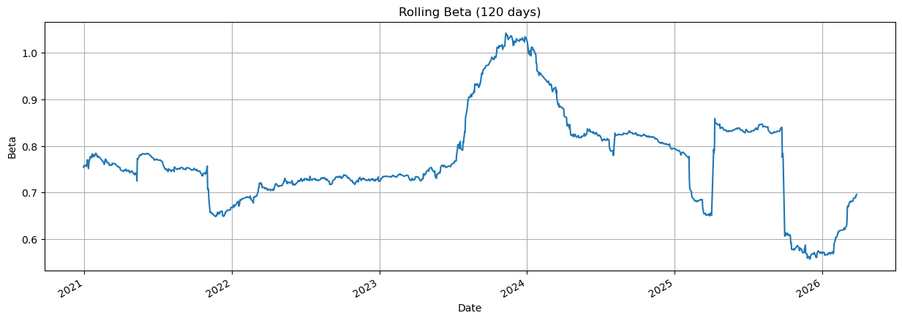

# Performance Analysis of a Taiwanese Stock Portfolio

## Project Description

This project analyzes a stock portfolio using Python. It produces:
* **5 key metrics**: Annual Return, Volatility, Sharpe Ratio, Beta, and Alpha
* **3 graphs**:
  * Cumulative return (Portfolio vs Market)
  * Rolling Sharpe Ratio
  * Rolling Beta

The portfolio input is a CSV file containing two columns:
* `stock`: stock ticker (".TW" will be automatically added if missing)
* `shares`: number of shares held

The analysis uses:
* Historical stock data and Taiwan Weighted Index (^TWII) from Yahoo Finance
* 3-month Taiwanese Treasury bill rates as the risk-free rate published by the Central Bank of the Republic of China (Taiwan)

---

## Project Structure
```
project/
├── main.py                  # Main program
├── requirements.txt         # Required Python packages
├── data/                    # Data files
│   └── Taiwan_treasury_bills_final.csv
├── images/                  # Example output (optional)
│   ├── result.png
│   ├── rolling_sharpe.png
│   └── rolling_beta.png
```

---

## Installation

```bash
# Navigate to your project folder
cd < your-project-folder >

# Install required packages
pip install -r requirements.txt
```

---

## How to Run

```bash
python main.py
```

After running, the program will ask you to input:
1. The path to your portfolio CSV file
2. The start date for analysis (format: YYYY-MM-DD)

---

## Example Input
The portfolio CSV file should look like this:

```csv
stock,shares
2330,100
2317,200
0050,50
```

## Example Output

  * Cumulative Return
  

  * Rolling Sharpe Ratio
  

  * Rolling Beta
  


## Notes
* If any stock in the portfolio was listed after the chosen start date,
  the analysis will automatically begin from the latest available date.

* Missing early data will be removed due to data alignment (`dropna`).

* The risk-free rate data (Taiwan Treasury Bills) is stored locally in:
  ```
  data/Taiwan_treasury_bills_final.csv
  ```
  (You may include the data source and download date here if needed.)

* The project is developed with the assistance of chatGPT.
